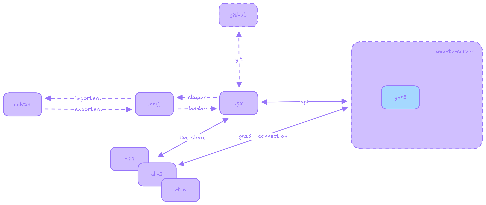

## Network Digital Twin

## Description
The aim of this thesis work is to create a network digital twin/shadow that takes a xml file from WeConfig and recreates the topology and configuration in gns3.

## Authors and acknowledgment
Oliver blixt and Oskar Sturebrand

## License
This project is licensed under the [Creative Commons Public License](https://github.com/westermo/Thesis-NDT?tab=CC-BY-4.0-1-ov-file)

## Project status
Completed
